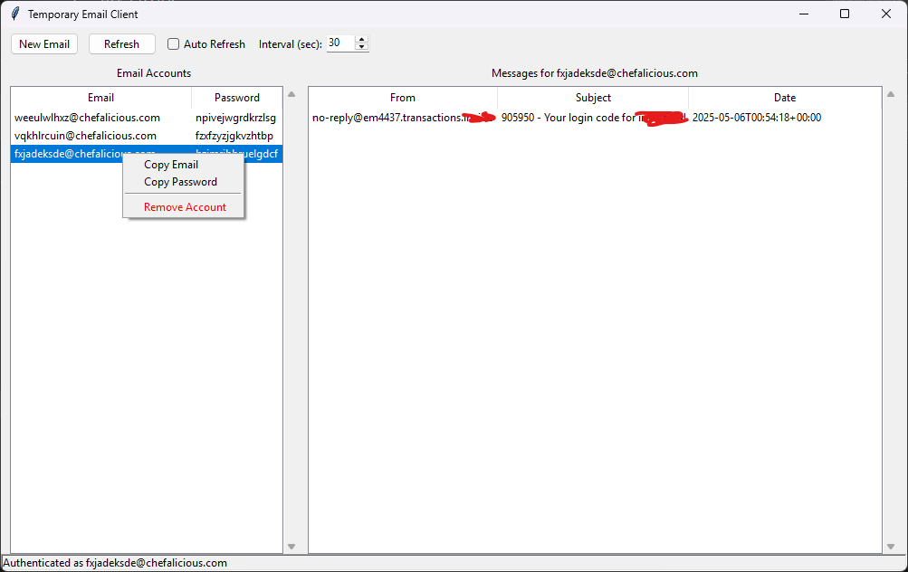

# 📧 TempBox

[](https://www.python.org/downloads/)
[](LICENSE)
[](https://www.python.org/dev/peps/pep-0008/)

TempBox is a modern, feature-rich temporary email client with both GUI and CLI interfaces. Create disposable email addresses instantly and manage your temporary communications with a clean, intuitive interface.



## ✨ Features

### 📱 Modern GUI Interface
- Beautiful Tkinter-based interface with a Gmail-like experience
- Real-time message updates with configurable auto-refresh
- Easy account switching and management
- Message preview and full-screen reading mode
- Copy email/password with a single click

### 📨 Email Management
- Create unlimited temporary email addresses
- Secure password generation
- Persistent storage of email accounts
- Quick message search and filtering
- Support for HTML messages
- Message attachments handling
- Save messages to JSON for backup

### 🔄 Real-time Updates
- Configurable auto-refresh (5-300 seconds)
- Background message checking
- New message notifications
- Multi-account monitoring

### 🛡️ Security
- Secure password generation
- No permanent data storage on servers
- Local-only account storage
- Session-based authentication

## 🚀 Quick Start

### Prerequisites

- Python 3.7 or higher
- pip (Python package manager)
- Git (optional)

### Installation

1. Clone the repository (or download ZIP):
```bash
git clone https://github.com/01RG0/Tempbox.git
cd tempbox
```

2. Create a virtual environment (recommended):
```bash
# Windows
python -m venv venv
venv\Scripts\activate

# Linux/macOS
python3 -m venv venv
source venv/bin/activate
```

3. Install dependencies:
```bash
pip install -r requirements.txt
```

### Running the Application

#### GUI Mode (Recommended)
```bash
python gui_app.py
```

#### CLI Mode
```bash
python main.py
```

## 📖 Usage Guide

### Creating a New Email

1. Launch the GUI application
2. Click "New Email" button
3. Your temporary email will be created instantly
4. The email and password will be saved automatically

### Managing Messages

- **Auto-Refresh**: Enable auto-refresh and set interval (5-300 seconds)
- **Manual Refresh**: Click the refresh button or press F5
- **View Message**: Double-click any message to open it
- **Save Message**: Right-click a message and select "Save to File"
- **Search**: Use the search box to filter messages

### Account Management

- **Switch Accounts**: Click any account in the left sidebar
- **Copy Email**: Double-click an account or use right-click menu
- **Copy Password**: Right-click an account and select "Copy Password"
- **Remove Account**: Right-click and select "Remove Account"

## 🔧 Configuration

The application saves configuration in the following files:

- `email_accounts.json`: Stores your email accounts (encrypted)
- `config.json`: Application settings (created on first run)

## 🛠️ Development

### Project Structure
```
tempbox/
├── gui_app.py         # GUI implementation
├── email_client.py    # Core email client functionality
├── storage.py         # Account storage handling
├── main.py           # CLI implementation
└── requirements.txt  # Python dependencies
```

### Running Tests
```bash
python -m pytest tests/
```

### Building from Source
```bash
# Install development dependencies
pip install -r requirements-dev.txt

# Run linting
flake8 .

# Run type checking
mypy .
```

## 🤝 Contributing

Contributions are welcome! Please feel free to submit a Pull Request.

1. Fork the repository
2. Create your feature branch (`git checkout -b feature/AmazingFeature`)
3. Commit your changes (`git commit -m 'Add some AmazingFeature'`)
4. Push to the branch (`git push origin feature/AmazingFeature`)
5. Open a Pull Request

## 📝 API Documentation

The application uses the Mail.tm API. Here are the key endpoints:

- `POST /accounts`: Create new email account
- `POST /token`: Authenticate and get access token
- `GET /messages`: Retrieve messages
- `GET /messages/{id}`: Get specific message
- `DELETE /messages/{id}`: Delete a message

## ⚙️ Technical Details

- **Backend**: Python with requests library
- **Frontend**: Tkinter with ttk widgets
- **Storage**: JSON-based local storage
- **Authentication**: JWT tokens
- **Message Format**: HTML/Plain text support

## 🔐 Security Notes

- Passwords are stored locally only
- Sessions are temporary and token-based
- No sensitive data is sent to third parties
- Auto-refresh uses secure token renewal

## 🐛 Troubleshooting

### Common Issues

1. **No messages appearing?**
   - Check your internet connection
   - Verify account authentication
   - Try manual refresh

2. **Authentication failed?**
   - Remove account and recreate
   - Check network connectivity
   - Verify API availability

3. **GUI not responding?**
   - Check CPU usage
   - Disable auto-refresh
   - Restart application

## 📱 Platform Support

- ✅ Windows 10/11
- ✅ macOS 10.15+
- ✅ Linux (major distributions)
- ✅ *BSD

## 📜 License

This project is licensed under the MIT License - see the [LICENSE](LICENSE) file for details.

## 📞 Support

- 🌟 Star this repo
- 🐛 [Report bugs](../../issues)
- 📝 [Request features](../../issues)
- 📖 [Wiki](../../wiki)

## 🙏 Acknowledgments

- [Mail.tm](https://mail.tm) for the API
- Python community
- All contributors

---
Made with ❤️ by RG Team
